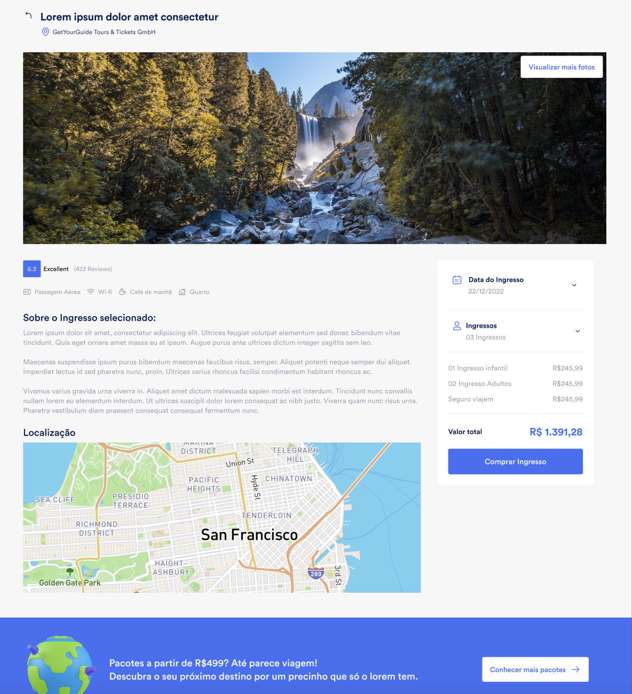

<h1>logoipsum</h1> 

> Status: concluído 🚀
### Desafio para desenvolvedor front-end para - Just Travel

### Descrição 

> Criar o Front-end de uma pagina de vendas de ingressos. Nos detalhes do ingresso é importante que o mesmo tenha as configurações necessarias para o bom funcionamento do SEO, 
gerando compartilhamentos nas redes sociais e indexação dos motores de busca

Requisitos
Listagem de ingressos: 
  + Popular listagem com ingressos
  + Listar Imagem, Titulo, Localizacao e Valor
  + Limitar a 10 ingressos por pagina
  + Ao clicar em um ingresso ser redirecionado + para os detalhes do mesmo
  + Criar um componente de filtros posibilitando filtrar por localizacao, preco

Detalhes do ingresso
Popular com todos os detalhes do ingresso
Permitir selecionar uma data
Selecionar quantidade de ingressos
Criar localizacao no mapa (googlemaps, leafletjs)

### Tecnologias
+ NextJs
+ Redux
+ AntDesign

### Adicionais
+ Api de ser consumida para o desafio segue abaixo
    
> Listagem de ingresso: https://62d085741cc14f8c088b8a7b.mockapi.io/api/v1/ticket

> Detalhes do ingresso: https://62d085741cc14f8c088b8a7b.mockapi.io/api/v1/ticket/:id

---
------
# 🎨 Layout 
O layout da aplicação está disponível no Figma : https://www.figma.com/file/SmKhOrWi7o9NT2DXBcIn57/Just-Travel---Front-End?node-id=37%3A2862

Como executar o projeto 🚀

#### Clone este repositório :
> git clone https://github.com/danrleyney2210/challenge_logoipsum.git

#### Acesse a pasta do projeto no seu terminal/cmd: 
> cd logoipsum

#### check se esta na banch main

#### Instalando dependências :
> yarn

###  ou

> npm install

### Execute a aplicação em modo de desenvolvimento
> yarn dev

###   ou

> npm run dev

### Comandos para build
> yarn build

### Depois
> yarn start

### A aplicação será aberta na porta:3000 - acesse http://localhost:3000

---- 
---

# 🛠 Tecnologias

> Principais dependências usadas no projeto: 🔥

+ Website (NextJs + Typescript) 

+ Ant design - Bibloteca para componentes

+ React Icons - Biblioteca de icones.

+ Styled Components - CSS-in-js

+ Prettier - Formatador de código opinativo.

+ Eslint - Ferramenta para identificar e relatar os padrões encontrados no código ECMAScript / JavaScript, com o objetivo de tornar o código mais consistente e evitar bugs.

+ Axios - Cliente HTTP baseado em promessa para node.
jse o navegador.

Veja o arquivo <a>package.json</a>

> Utilitários
+ Protótipo: Figma
+ Editor: Visual Studio Code

---
### 🦸 Desenvolvedor 🤘

## 📝 Licença
Este projeto esta sobe a licença MIT.

Feito com ❤️ por Danrley Ney 👋🏽 Entre em contato!

> Email: danrley.dev@gmail.com

> Twitter: @danrleyney

